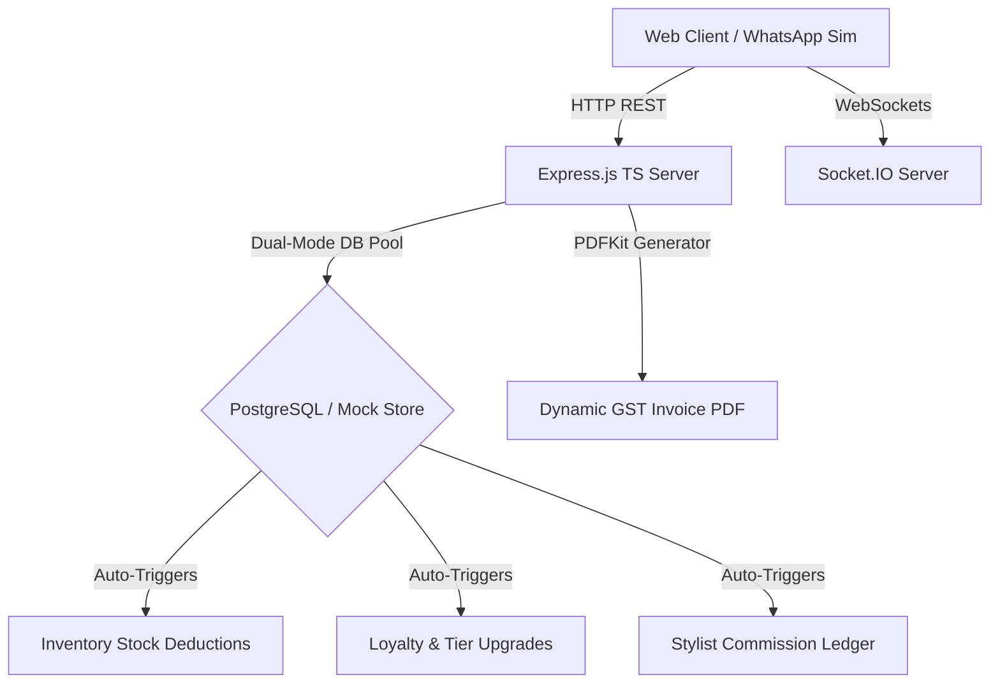

# 🏛️ GlamourOS System Architecture

GlamourOS is built on a robust, enterprise-grade multi-branch monorepo architecture. It connects interactive React frontends, real-time Socket.IO communication, dynamic Indian retail tax systems, and database-level trigger automation.

---

## 🏗️ Monorepo Architectural Flow

---

## 💻 Tech Stack Layers

### 1. Frontend Client Workspace (`/frontend`)
*   **Core Framework**: Next.js 14 (App Router, TypeScript)
*   **Design & Theme**: Tailwind CSS, Vanilla HSL palettes (Flat, Linear-inspired dark interface, no soft gradients)
*   **State Orchestrator**: Zustand. Integrates defensive query syncs: if the local REST server is offline or loading, the store auto-routes actions to an in-memory client-side data simulation.
*   **Visualizations**: Recharts (responsive flat area charts, load distributions, and membership pies).

### 2. Backend API Workspace (`/backend`)
*   **Runtime Environment**: Node.js, Express.js (TypeScript)
*   **Real-time Communication**: Socket.IO for active dashboard synchronization.
*   **Document Generation**: PDFKit streaming clean, certified Indian tax receipts directly to the HTTP stream.
*   **Relational Engine**: `pg` client. Integrates an automatic fallback connector that routes queries to local static mock stores if PostgreSQL variables are absent.

### 3. Database & Operations (`/database`)
*   **DBMS**: PostgreSQL (with Supabase connection capabilities).
*   **Automatic Triggers**:
    *   `auto_deduct_inventory()`: deducts hair dyes or styling products when appointments transition to `Completed`.
    *   `auto_update_crm_tier()`: calculates customer loyalty scores (1 point per ₹100) and advances members to Silver, Gold, or Platinum status.
    *   `auto_calculate_commissions()`: splits checkout totals to stylist ledgers based on experience levels (Junior 20%, Senior 30%, Master 35%).
